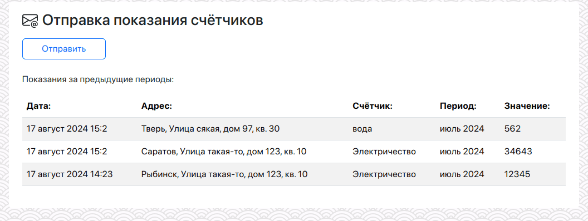
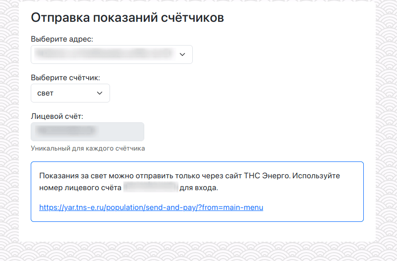

# Mail Utilities Wizard

A tiny web-service that helps send meter readings to utility companies.

[На русском](README.ru.md)

Main page with history data:



Send page:


Letter preview:


If company doesn't support direct mail send you can show a proper link and short manual:



## My story

My aged parents send house counters to different public utilities by mail. Such companies don't have any web-sites or mobile apps.
Each utility company has own letter format requirements. It makes my parents to suffer.

It's a great opportunity to try [Axum](https://github.com/tokio-rs/axum) after many years with [actix](https://github.com/actix/actix-web) ;)

## Install

```shell
mkdir {data,templates,logs}
chmod -R 777 {data,logs}

# Put your mail template into `templates` folder
cp templates/example.txt templates/template.txt

# Prepare config files
cp config.yml-dist config.yml
cp locale.yml-dist locale.yml

# Edit config.yml

docker-compose up -d
```

Open http://localhost:8080

## How it works

A service provides web interface for user:

- Location
- Type of counter (water, electricity, etc)
- Account ID
- Month (default: previous month)
- Value
- Send button

## Template variables

Check `templates/example.txt`.

## RoadMap

1. Support optional password access 
2. Support state for each location
3. Remind about data sending