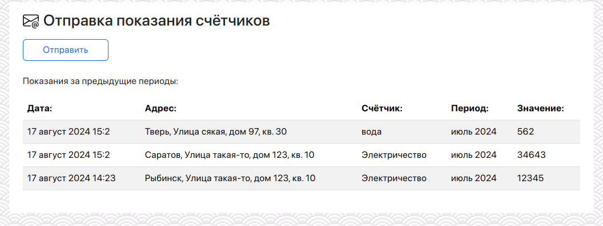
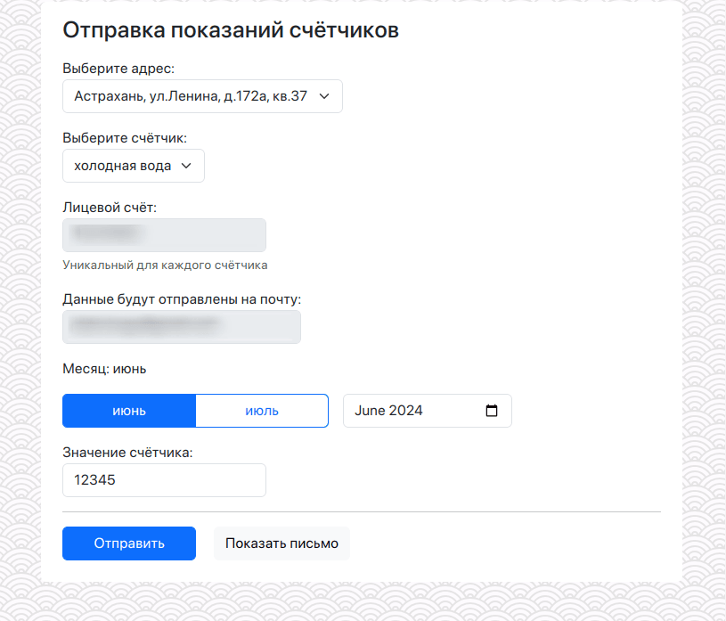
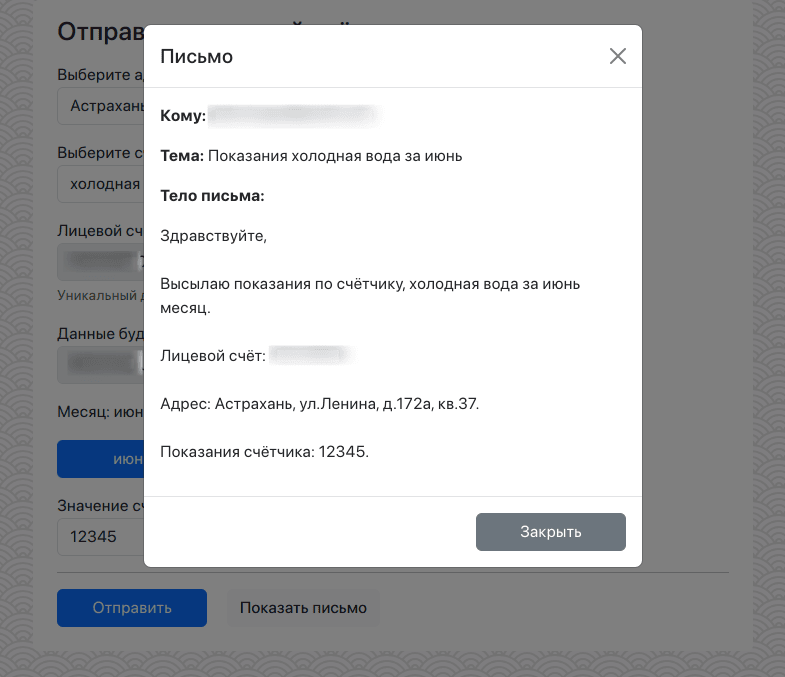
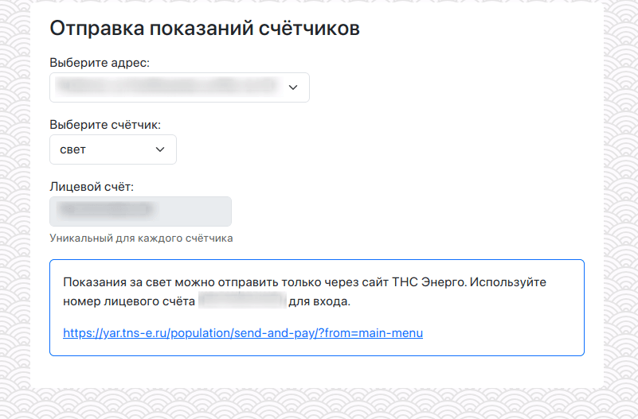

# Mail Utilities Wizard

Web-сервис, который помогает отправлять показания счётчиков в коммунальные службы.

[English](README.md)







Если компания не принимает показания по почте, то можно указать ссылку и краткую инструкцию:


## Моя история

Мои родители (в возрасте) должны отправлять показания счётчиков в разные коммунальные службы. 
К сожалению, данные компании принимают показания только по почте. Это заставляет родителей страдать.

Также это прекрасная возможность попробовать [Axum](https://github.com/tokio-rs/axum) спустя много лет с [actix](https://github.com/actix/actix-web) ;)

## Установка

```shell
mkdir -p logs,templates,data
chmod -R 777 {logs,data}

# Готовим файлы конфигурации
cp config.yml-ru config.yml
cp locale.yml-ru locale.yml

# Положите файл шаблона письма в папку `templates`
cp templates/example-ru.txt templates/template.txt

docker-compose up -d
```

Приложение будет доступно по адресу http://localhost:8080

## Как это работает

Сервис предоставляет пользователю web-интерфейс с выбором локации, типа показаний, месяца (автоматически выбирается предыдущий), вводом значения и кнопкой Отправить.
Когда пользователь жмёт Отправить, сервис формирует письмо на базе шаблона (настраиваемый шаблонизатор) и 
отправляет в нужном формате и с нужной темой по нужному адресу.

Сервис отправляет копию отправленного письма на указанный ящик (поле `email-copy`).

## Шаблонизатор и переменные

Тема письма формируется по шаблону из конфигурации `config.yml` (поле `mail-subject-template`).

Тело письма формируется по шаблону из файла. Пример в `templates/example-ru.txt`. 
Все имена поддерживаемых переменных можно подсмотреть в данном файле.

Для каждого счётчика можно указать отдельный шаблон.

## RoadMap

1. Поддержка доступа по паролю (опционально)
2. Запоминать дату и время отправки счётчиков
3. Напоминать о необходимости отправки показателей